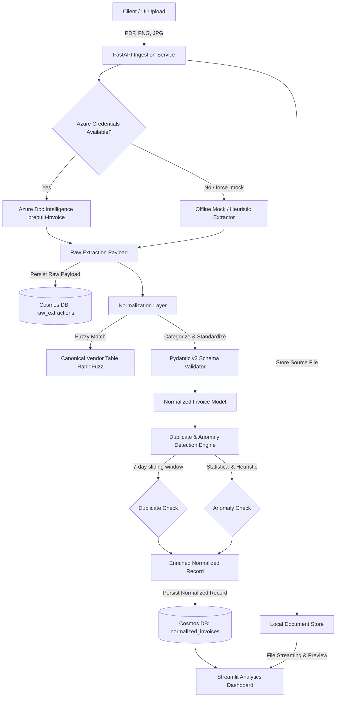

# Project: Document Intelligence Pipeline

## Architecture
The Document Intelligence Pipeline is an enterprise-grade automated invoice and receipt processing system. It consists of:
1. **Document Ingestion & Extraction Engine (FastAPI)**: Ingests PDF, PNG, and JPEG documents, stores source files, and extracts structured key-value data using Azure Document Intelligence `prebuilt-invoice` model with an automated, robust offline mock fallback.
2. **LLM & Rule Normalization Layer (Pydantic v2)**: Transforms raw extraction payloads into validated schemas, executes canonical vendor fuzzy matching via RapidFuzz, categorizes spend into an 11-category taxonomy, and standardizes dates (ISO 8601) and currencies (ISO 4217).
3. **Dual-Storage Cosmos DB Abstraction**: Stores raw extraction documents (`raw_extractions`) and normalized records (`normalized_invoices`) linked by correlation IDs, with a high-fidelity local SQLite/JSON mock repository for 100% offline testability.
4. **Duplicate & Anomaly Detection Engine**: Identifies duplicate invoice submissions (same canonical vendor + identical amount within a 7-day sliding window) and flags 6 distinct anomaly types (extreme amounts, unknown vendors, currency mismatch, line-item arithmetic discrepancies, date anomalies, missing fields).
5. **Streamlit Analytics & Verification Dashboard**: Interactive UI providing KPI metrics, spend by month/vendor/category, split-screen verification queue with interactive PDF/image source preview alongside extracted fields, and live upload lab.
6. **Multi-Tier E2E Test Suite & Benchmarks**: 10 diverse invoice fixtures, pytest suite covering Tiers 1-5, and comprehensive benchmark documentation.



## Feature Inventory
| # | Feature | Description | Milestone | Source |
|---|---------|-------------|-----------|--------|
| 1 | FastAPI Ingestion Service | Multipart `/upload` and `/api/v1/upload` endpoints supporting PDF, PNG, JPG with validation | M1 | ORIGINAL_REQUEST §R1 |
| 2 | Azure Doc Intelligence Client | SDK integration with `prebuilt-invoice` model extracting vendor, dates, totals, taxes, and line items | M1 | ORIGINAL_REQUEST §R1 |
| 3 | Offline Mock Fallback Engine | Hash-based fixture matcher + regex heuristic extractor activating automatically without credentials | M1 | ORIGINAL_REQUEST §R1 |
| 4 | Source Document Storage | Local file persistence and streaming endpoint `/api/v1/documents/{id}/file` for UI preview | M1 | ORIGINAL_REQUEST §R1 |
| 5 | Pydantic v2 Data Models | Strict typed schemas for `LineItem`, `RawInvoicePayload`, `NormalizedInvoice`, `AnomalyRecord` | M2 | ORIGINAL_REQUEST §R2 |
| 6 | Canonical Vendor Fuzzy Matcher | RapidFuzz token sorting matching noisy vendor strings against 15+ known vendor reference table | M2 | ORIGINAL_REQUEST §R2 |
| 7 | Spend Categorization Taxonomy | 11-category spend classification mapping line items and invoices to standard categories | M2 | ORIGINAL_REQUEST §R2 |
| 8 | ISO Date & Currency Standardizer | Robust date parsing to `YYYY-MM-DD` and currency symbol to ISO 4217 standard codes | M2 | ORIGINAL_REQUEST §R2 |
| 9 | Cosmos DB Dual-Storage Layer | Separate containers for raw extractions and normalized invoices with correlation ID tracking | M2 | ORIGINAL_REQUEST §R2 |
| 10 | Local SQLite/JSON Mock Repository | High-fidelity local database layer mimicking Cosmos DB for 100% offline execution and testing | M2 | ORIGINAL_REQUEST §R2 |
| 11 | 7-Day Window Duplicate Detection | Business rule flagging same canonical vendor + identical amount within a +/- 7 day window | M3 | ORIGINAL_REQUEST §R3 |
| 12 | Multi-Type Anomaly Detection | Anomaly detection for extreme amounts (>IQR/Z-score), unknown vendors, currency mismatches, math errors | M3 | ORIGINAL_REQUEST §R3 |
| 13 | Query & Analytics API Endpoints | REST endpoints for querying invoices, duplicates, anomalies, and summary aggregates | M3 | ORIGINAL_REQUEST §R3 |
| 14 | Streamlit Executive Spend Analytics | KPI cards and interactive charts for monthly spend, vendor breakdown, and category breakdown | M4 | ORIGINAL_REQUEST §R4 |
| 15 | Split-Screen Verification Queue | Interactive table with drill-down displaying source PDF/image preview alongside parsed fields | M4 | ORIGINAL_REQUEST §R4 |
| 16 | Live Upload & Ingestion Lab UI | Streamlit interactive drag-and-drop file upload with live pipeline execution visualization | M4 | ORIGINAL_REQUEST §R4 |
| 17 | 10 Diverse Sample Fixtures | Matrix of 10 invoice files (PDF/images) with ground-truth JSONs covering standard, typos, FX, duplicates | M5 / E2E | ORIGINAL_REQUEST §R5 |
| 18 | Multi-Tier Pytest Test Suite | Tiers 1-4 test suite covering feature coverage, boundaries, combinations, and E2E scenarios | M5 / E2E | ORIGINAL_REQUEST §R5 |
| 19 | Adversarial Coverage Hardening | Tier 5 white-box stress testing and edge-case validation by Challenger agents | M5 | Strategy |
| 20 | Benchmark Report & Documentation | Complete benchmark matrix across 10 sample fixtures and comprehensive `README.md` | M6 | ORIGINAL_REQUEST §R5 |

## Milestones
| # | Name | Scope | Dependencies | Status |
|---|------|-------|-------------|--------|
| E2E | E2E Testing Track | 10 sample fixtures, ground-truth data, opaque-box test runner, Tiers 1-4 tests (`TEST_READY.md`) | none | DONE |
| 1 | M1: Ingestion & Azure Extraction | FastAPI `/upload`, Azure Doc Intelligence client, offline mock fallback engine, source storage | none | DONE |
| 2 | M2: Normalization & Cosmos DB | Pydantic v2 schemas, RapidFuzz vendor matcher, spend taxonomy, ISO standardizer, dual-storage | M1 | IN_PROGRESS |
| 3 | M3: Duplicate & Anomaly Engine | 7-day duplicate detection, 6 anomaly types, risk scoring, query & analytics REST endpoints | M2 | PLANNED |
| 4 | M4: Streamlit Dashboard | 5-tab dashboard: spend metrics, charts, split-screen verification with source preview, live upload | M3 | PLANNED |
| 5 | M5: E2E Acceptance & Hardening | Run 100% passing E2E test suite (Tiers 1-4) + Tier 5 adversarial stress testing + Forensic Audit | E2E, M4 | PLANNED |
| 6 | M6: Benchmark Report & README | 10-fixture accuracy/latency benchmark report, Mermaid architecture diagram, README.md | M5 | PLANNED |

## Interface Contracts

### M1 ↔ M2: Ingestion Payload & Raw Extraction
- **Input to M1**: `file: UploadFile`, `correlation_id: Optional[str]`, `force_mock: Optional[bool]`
- **Output from M1**: `RawInvoicePayload` containing:
  - `document_id: str` (UUIDv4)
  - `correlation_id: str` (UUIDv4)
  - `filename: str`
  - `storage_path: str`
  - `raw_fields: Dict[str, ExtractedField]` (keys: `VendorName`, `InvoiceId`, `InvoiceDate`, `DueDate`, `SubTotal`, `TotalTax`, `InvoiceTotal`, `AmountDue`, `CustomerName`, `PurchaseOrder`)
  - `raw_items: List[Dict[str, Any]]`
  - `confidence_scores: Dict[str, float]`
  - `extraction_engine: str` (`"azure_prebuilt_invoice"` or `"mock_fallback"`)

### M2 ↔ M3: Normalized Invoice Model
- **Input to M2**: `RawInvoicePayload`
- **Output from M2**: `NormalizedInvoice` containing:
  - `id: str` (UUIDv4)
  - `document_id: str`
  - `correlation_id: str`
  - `vendor_raw: str`
  - `vendor_canonical: str`
  - `vendor_id: Optional[str]`
  - `vendor_match_score: float`
  - `is_known_vendor: bool`
  - `invoice_number: str`
  - `invoice_date: str` (`YYYY-MM-DD`)
  - `due_date: Optional[str]` (`YYYY-MM-DD`)
  - `currency_raw: str`
  - `currency_iso: str` (ISO 4217: `USD`, `EUR`, `GBP`, `JPY`, etc.)
  - `subtotal: Optional[float]`
  - `tax_amount: Optional[float]`
  - `total_amount: float`
  - `amount_due: Optional[float]`
  - `spend_category: str` (one of 11 canonical categories)
  - `line_items: List[NormalizedLineItem]`
  - `storage_path: str`
  - `created_at: str` (ISO 8601 timestamp)

### M3 ↔ M4 & Storage: Duplicate & Anomaly Flags
- **Input to M3**: `NormalizedInvoice`, `existing_records: List[NormalizedInvoice]`
- **Output from M3**: Enriched `NormalizedInvoice` with:
  - `is_duplicate: bool`
  - `duplicate_of_id: Optional[str]`
  - `duplicate_reason: Optional[str]`
  - `duplicate_match_details: Optional[Dict[str, Any]]`
  - `has_anomalies: bool`
  - `anomaly_flags: List[AnomalyFlag]` (each with `anomaly_type`, `severity`, `description`, `details`)
  - `risk_score: float` (0.0 to 1.0)

## Code Layout
```
n:/01-PROJECTS/DOCUMENT INTELLIGENCE PIPELINE/
├── pyproject.toml                     # PEP 621 packaging and dependencies
├── README.md                          # Architecture diagram, setup, benchmark report
├── data/
│   ├── uploads/                       # Persisted uploaded source documents (PDF/PNG/JPG)
│   └── store/                         # Local mock SQLite/JSON database storage
├── src/
│   ├── __init__.py
│   ├── config.py                      # Application configuration & environment settings
│   ├── core/
│   │   ├── __init__.py
│   │   └── models.py                  # Pydantic v2 schemas (Raw, Normalized, LineItem, Anomaly)
│   ├── services/
│   │   ├── __init__.py
│   │   ├── extraction/
│   │   │   ├── __init__.py
│   │   │   ├── azure_client.py        # Azure Document Intelligence prebuilt-invoice client
│   │   │   └── mock_extractor.py      # Offline mock & heuristic extraction fallback
│   │   ├── normalization/
│   │   │   ├── __init__.py
│   │   │   ├── normalizer.py          # LLM & deterministic normalization engine
│   │   │   ├── vendor_matcher.py      # RapidFuzz canonical vendor resolver
│   │   │   └── taxonomy.py            # 11-category spend classification rules
│   │   ├── detection/
│   │   │   ├── __init__.py
│   │   │   ├── duplicate_engine.py    # 7-day sliding window duplicate detector
│   │   │   └── anomaly_engine.py      # Multi-rule anomaly detector & risk scorer
│   │   └── storage/
│   │       ├── __init__.py
│   │       ├── base.py                # Abstract storage repository interface
│   │       ├── cosmos_client.py       # Azure Cosmos DB dual-container repository
│   │       └── local_store.py         # Local JSON/SQLite mock repository
│   ├── api/
│   │   ├── __init__.py
│   │   ├── app.py                     # FastAPI application factory & lifespan
│   │   └── routes.py                  # Endpoints: /upload, /invoices, /health, /documents
│   └── dashboard/
│       ├── __init__.py
│       ├── app.py                     # Streamlit entry point
│       └── views/
│           ├── __init__.py
│           ├── executive_kpis.py      # Executive spend KPI cards
│           ├── spend_analytics.py     # Monthly, vendor, category charts
│           ├── verification_queue.py  # Split-screen verification & preview
│           └── live_upload.py         # Interactive drag-and-drop live lab
└── tests/
    ├── conftest.py                    # Pytest fixtures, mock DB, test clients
    ├── fixtures/
    │   ├── sample_invoices/           # 10 sample files (PDF, PNG, JPG) + ground truth JSONs
    │   └── mock_azure_responses/      # Raw Azure response fixtures
    ├── unit/
    │   ├── test_extraction.py
    │   ├── test_normalization.py
    │   ├── test_vendor_matching.py
    │   ├── test_duplicate_engine.py
    │   └── test_anomaly_engine.py
    ├── integration/
    │   ├── test_api_routes.py
    │   └── test_storage_dual.py
    └── e2e/
        ├── test_pipeline_e2e.py
        └── test_fixture_matrix.py
```
