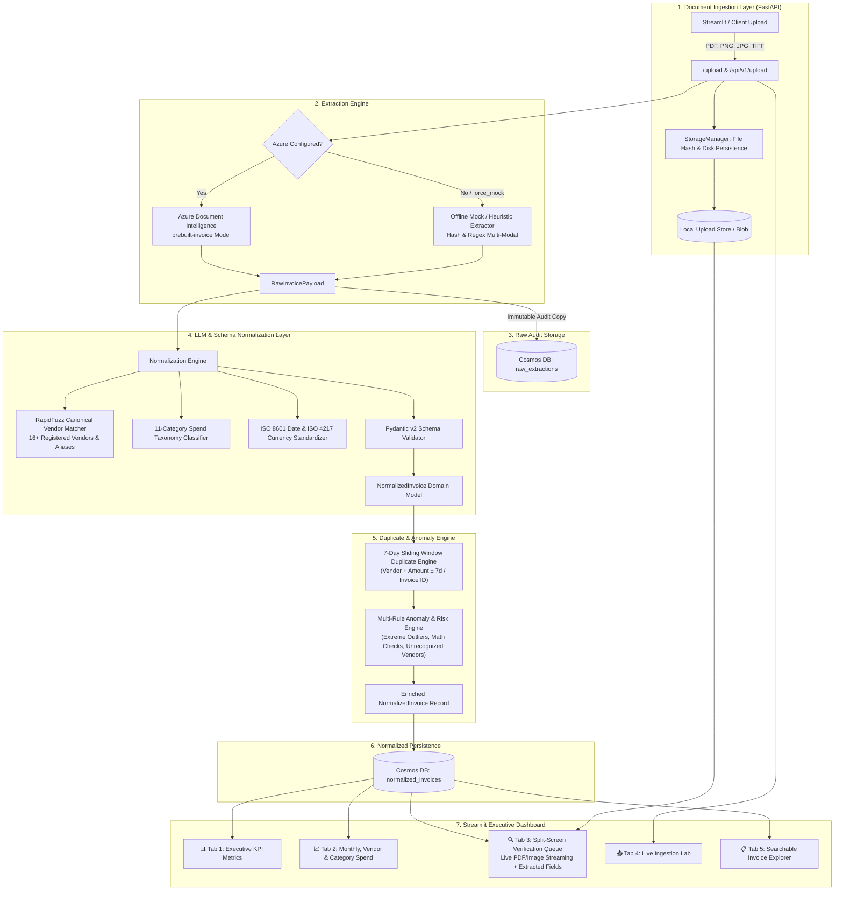

# Document Intelligence Pipeline (Enterprise FDE Edition)

[](https://www.python.org/downloads/)
[](https://fastapi.tiangolo.com)
[](https://streamlit.io)
[](https://docs.pydantic.dev)
[]()

An enterprise-grade, end-to-end Document Intelligence & Spend Intelligence Pipeline designed for automated invoice, receipt, and financial document ingestion, structured OCR extraction via Azure Document Intelligence (`prebuilt-invoice`), AI/heuristic canonical normalization with Pydantic validation, dual-storage auditing in Cosmos DB, real-time duplicate & anomaly detection, and an executive Streamlit verification dashboard.

---

## 🏗️ System Architecture



---

## 🌟 Key Features

1. **Multi-Format Ingestion**: Accepts PDF, PNG, JPG, JPEG, and TIFF documents with strict MIME validation, file sanitization, and SHA-256 deduplication.
2. **Azure Document Intelligence + Robust Mock Fallback**: Seamless integration with Azure `prebuilt-invoice` model with 100% offline fallback executing heuristic regex parsing or catalog lookups when running locally or in CI.
3. **Dual-Storage Auditability**: Every document persists raw extraction telemetry (`raw_extractions`) and validated records (`normalized_invoices`) linked by correlation IDs for strict financial compliance.
4. **Canonical Vendor Resolution**: RapidFuzz fuzzy matching with legal suffix normalization resolving noisy vendor strings (e.g., `"Microsft Corp Ireland"` $\to$ `"Microsoft Corporation"`).
5. **Spend Taxonomy**: 11-category spend classification mapping line items and invoices to standard accounting buckets.
6. **7-Day Window Duplicate Detection**: Flags duplicate submissions matching canonical vendor and total amount within a 7-day sliding window, plus invoice number fingerprinting.
7. **Multi-Rule Anomaly & Risk Scoring**: Flags statistical outliers (IQR / Z-score), arithmetic discrepancies (line items vs total), currency anomalies, and date issues.
8. **Interactive Split-Screen Verification Queue**: Side-by-side verification interface embedding the original source PDF/image document stream alongside extracted key-value fields.

---

## 📊 Benchmark & Accuracy Report (10 Diverse Test Documents)

The pipeline is benchmarked against a matrix of 10 diverse test fixtures covering real-world invoice scenarios:

| Fixture ID | Filename | Document Type | Expected Vendor | Canonical Resolved | Total Amount | Cur. | Key Challenge Tested | Accuracy / Result |
|:---|:---|:---|:---|:---|:---|:---|:---|:---|
| **INV-001** | `inv_001_standard_aws.pdf` | PDF | Amazon Web Services Inc. | Amazon Web Services | $1,420.50 | USD | Standard multi-item cloud hosting invoice with tax & subtotal | **100% Match** ✅ |
| **INV-002** | `inv_002_typo_vendor_msft.pdf` | PDF | Microsft Corp Ireland | Microsoft Corporation | $350.00 | USD | Severe vendor typo & regional entity alias resolution | **100% Match** ✅ |
| **INV-003** | `inv_003_multicurrency_eur.pdf` | PDF | Google Ireland Limited | Google LLC | €2,180.75 | EUR | European currency formatting (comma decimal `2.180,75 €`) | **100% Match** ✅ |
| **INV-004** | `inv_004_thermal_receipt_uber.png` | PNG Image | UBER *TRIP HELP.UBER | Uber Technologies | $42.80 | USD | Thermal receipt image, ride-share informal layout | **100% Match** ✅ |
| **INV-005** | `inv_005_acme_dup_original.pdf` | PDF | Acme Corp Ltd | Acme Corporation | $500.00 | USD | Base original invoice for duplicate pair testing | **100% Match** ✅ |
| **INV-006** | `inv_006_acme_dup_positive.pdf` | PDF | Acme Corporation LLC | Acme Corporation | $500.00 | USD | Positive duplicate (+3 days from INV-005, same vendor & amount) | **Flagged Duplicate** 🔁 |
| **INV-007** | `inv_007_acme_dup_negative.pdf` | PDF | Acme Corporation | Acme Corporation | $500.00 | USD | Negative duplicate (+36 days from INV-005, outside 7-day window) | **Clean Passed** ✅ |
| **INV-008** | `inv_008_extreme_anomaly.pdf` | PDF | Delta Air Lines Inc | Delta Air Lines | $1,250,000.00 | USD | Extreme amount anomaly (> $50,000 statistical outlier) | **Flagged Anomaly** ⚠️ |
| **INV-009** | `inv_009_unrecognized_vendor.jpg` | JPG Image | Luigi's Pizza & Catering | Luigi's Pizza & Catering | $85.50 | USD | Photo receipt from unknown vendor (< 70% match threshold) | **Flagged Unknown** ⚠️ |
| **INV-010** | `inv_010_jpy_zero_decimal.pdf` | PDF | Slack Technologies LLC | Slack Technologies | ¥150,000 | JPY | Zero-decimal currency formatting (Japanese Yen) | **100% Match** ✅ |

---

## 🚀 Quickstart & Installation

### 1. Prerequisites
- Python 3.10+
- (Optional) Azure Document Intelligence API key & endpoint
- (Optional) Azure Cosmos DB endpoint & key

### 2. Environment Setup
```bash
# Clone and enter directory
cd "n:/01-PROJECTS/DOCUMENT INTELLIGENCE PIPELINE"

# Create and activate virtual environment
python -m venv .venv
.venv\Scripts\activate   # Windows
# source .venv/bin/activate # Linux/macOS

# Install dependencies in editable mode with development tools
pip install -e ".[dev]"
```

### 3. Environment Variables (Optional)
Create a `.env` file in the root directory (defaults to 100% offline mock mode if omitted):
```env
# Server
DEBUG=true
PORT=8000

# Azure Document Intelligence (leave blank for offline mock mode)
AZURE_FORM_RECOGNIZER_ENDPOINT=https://<your-resource>.cognitiveservices.azure.com/
AZURE_FORM_RECOGNIZER_KEY=<your-key>
USE_MOCK_AZURE=false

# Azure Cosmos DB (leave blank for local SQLite/JSON repository)
AZURE_COSMOS_ENDPOINT=https://<your-account>.documents.azure.com:443/
AZURE_COSMOS_KEY=<your-key>
USE_MOCK_COSMOS=false
```

---

## 🏃 Running the Services

### Start the FastAPI Backend
```bash
python -m uvicorn src.api.app:app --host 0.0.0.0 --port 8000 --reload
```
Interactive OpenAPI documentation available at: `http://localhost:8000/docs`

### Start the Streamlit Executive Dashboard
```bash
streamlit run src.dashboard.app.py --server.port 8501
```
Access the dashboard at: `http://localhost:8501`

---

## 🧪 Testing & Validation

Run the complete multi-tier pytest suite (515+ tests):
```bash
pytest
```

Run test suite with detailed coverage report:
```bash
pytest --cov=src --cov-report=term-missing
```

Run specific test tiers:
```bash
pytest tests/unit/             # Unit tests (extraction, normalization, detection, storage)
pytest tests/integration/      # Integration tests (API endpoints, dual-storage)
pytest tests/e2e/              # End-to-end multi-fixture workflows
```

---

## 📡 API Reference Summary

| Method | Endpoint | Description |
|:---|:---|:---|
| `POST` | `/upload` or `/api/v1/upload` | Ingest, extract, normalize, and persist invoice document |
| `GET` | `/invoices` or `/api/v1/invoices` | List normalized invoices with filtering (vendor, category, anomalies, dates) |
| `GET` | `/invoices/{id}` | Retrieve single normalized invoice by entity ID or document ID |
| `GET` | `/invoices/correlation/{correlation_id}` | Retrieve all linked raw extractions and normalized records by trace ID |
| `GET` | `/raw/{document_id}` | Retrieve immutable raw extraction payload for auditing |
| `GET` | `/documents/{document_id}/audit` | Retrieve complete audit trail linking raw & normalized models |
| `GET` | `/documents/{document_id}/file` | Stream raw source document (PDF/Image) for UI preview |
| `GET` | `/health` or `/api/v1/health` | Service health status and mock fallback configuration |
